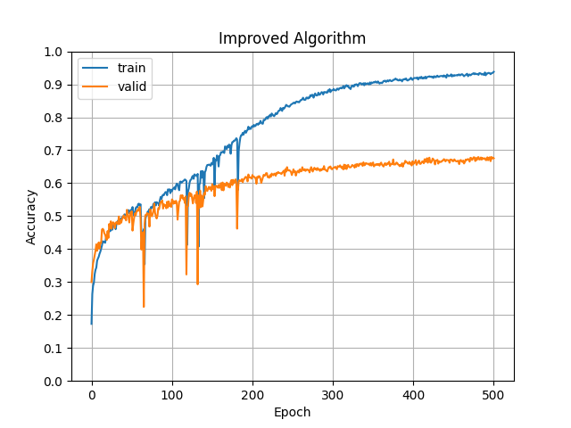
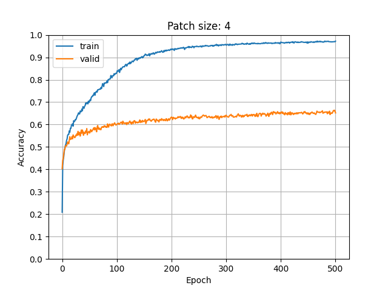
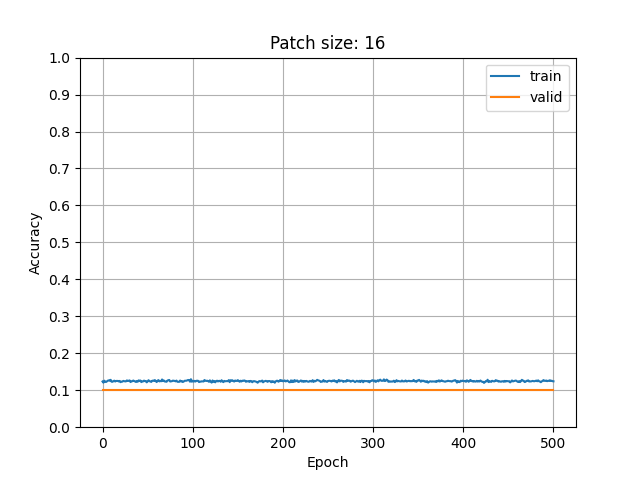
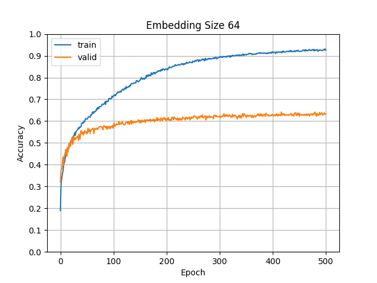
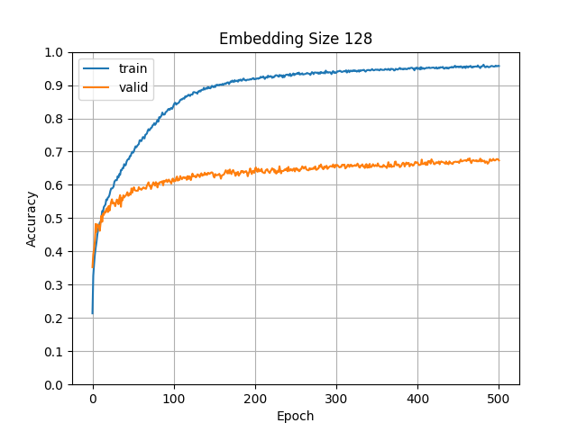
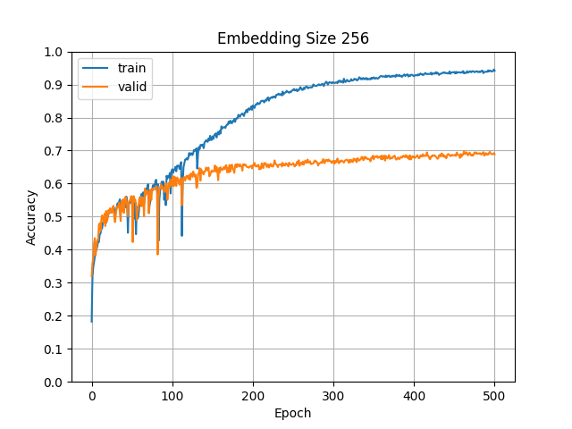
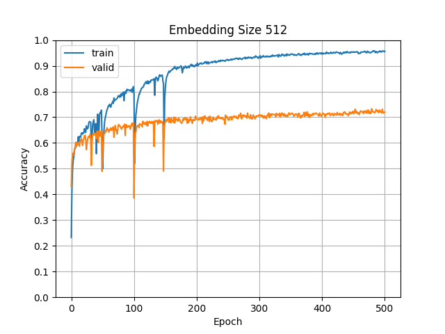
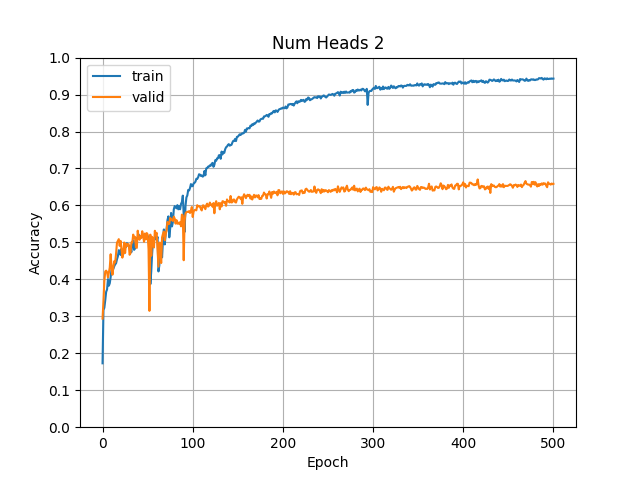
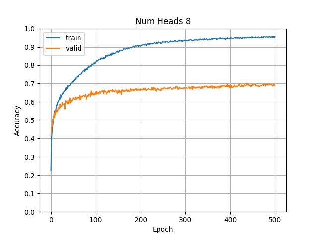
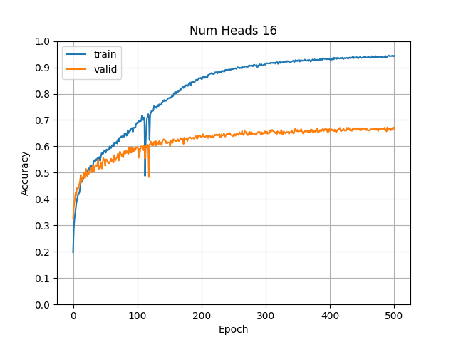

# 深度学习与计算机视觉实验三： CIFAR-ViT

<center>
<div class="is-size-5 publication-authors">
<span class="author-block">
  <b style="font-size: 20px;">宁毓伟</b><sup></sup>&nbsp;&nbsp;&nbsp;&nbsp;&nbsp;
</span>
<span class="author-block">
  <b style="font-size: 20px;">杨进岳</b><sup>*</sup></span>&nbsp;&nbsp;&nbsp;&nbsp;&nbsp;
<span class="author-block">
  <b style="font-size: 20px;">张子陆</b><sup>*</sup>&nbsp;&nbsp;&nbsp;&nbsp;&nbsp;
</span>
<span class="author-block">
  <b style="font-size: 20px;">张圣权</b><sup>*</sup>
</span>
</div>
</center>
<center>
<div>
<p style="font-size: 16px;"><sup>*</sup>表示同等贡献</p>
</div>
</center>

> 分工：
> - 宁毓伟(U202115325)：写代码、做实验、写报告。
> - 杨进岳(U202114049)：写一点代码。
> - 张子陆(U202115070)：做一点实验。
> - 张圣权(U202112179)：写一点报告。
> 
> 工作量不好量化，因此确切的组内贡献比例无法给出。望老师海涵。

## Vision Transformer网络的介绍与实现（要求2.1，必做部分）

> 相关代码位于 ``vit.py`` 文件中。

Vision Transformer 共包含有以下几个主要模块：

1. Multi-head Self-Attention (MSA)
2. Feed Forward Network (FFN)
3. Patch Embedding
4. Normalization Layer

[💡]本文的实现与文章 *An Image is Worth 16x16 Words: Transformers for Image Recognition at Scale* 中的实现有所不同：
  1. 本文并未使用 Class token, 这一点与其同时期的另一篇文章 *Swin Transformer: Hierarchical Vision Transformer using Shifted Windows* 保持一致。
  2. 本文使用的Normalization Layer是BatchNorm2d，而不是LayerNorm。


在本章节中，我会详细介绍这几个模块的实现。

### Multi-head Self-Attention (MSA)

Self-Attention 是 Transformer 中的核心模块，它能够捕捉输入序列中不同位置之间的依赖关系。Attention 的计算过程如下：

$$
\text{Attention}(Q, K, V) = \text{softmax}\left(\frac{QK^T}{\sqrt{d_k}}\right)V
$$

其中 $Q, K, V$ 分别代表 Query, Key, Value，$d_k$ 代表 Key 的维度。在实际应用中，我们通常会将 $Q, K, V$ 分别通过线性变换得到 $Q', K', V'$，然后再进行 Attention 的计算。对于 Multi-head Self-Attention，我们会将 $Q, K, V$ 分别通过 $h$ 个线性变换得到 $Q_i, K_i, V_i$，然后将 $h$ 个 Attention 的结果拼接起来，再通过一个线性变换得到最终的输出。

```python
class Attention(nn.Module):
    """
    Attention for images
    Input:
        - x: (B, C, H, W), already patched
    Output:
        - x: (B, C, H, W)
    """
    def __init__(
            self,
            in_channels: int,
            num_heads: int,
            dropout: float = 0.0
        ):
        assert in_channels % num_heads == 0, \
            f"in_channels(got {in_channels}) must be divisible by num_heads(got {num_heads})"

        super().__init__()
        self.qkv_transform = nn.Conv2d(
            in_channels=in_channels,
            out_channels=in_channels * 3,
            kernel_size=1,
            stride=1,
            padding=0,
            bias=False,
        )
        # self.dropout = nn.Dropout(dropout)
        self.dropout = dropout
        self.softmax = nn.Softmax(dim=-1)
        self.num_heads = num_heads
        self.scale = in_channels ** -0.5
    
        self._init_weights()
    
    def _init_weights(self):
        nn.init.xavier_uniform_(self.qkv_transform.weight)

    def drop_attn(self, attn):
        B, h, N, _ = attn.shape
        mask = torch.rand((B, h, N, N), device=attn.device) < self.dropout
        attn[mask] = float('-inf')
        return attn

    def forward(self, x):
        B, C, H, W = x.shape
        qkv = self.qkv_transform(x)
        q, k, v = torch.chunk(qkv, 3, dim=1)
        q, k, v = map(lambda t: rearrange(t, 'B (h d) H W -> B h (H W) d', h=self.num_heads), (q, k, v))
        
        attn = (q @ k.transpose(-2, -1)) * self.scale # (B, h, H*W, H*W)
        attn = self.drop_attn(attn)
        x = self.softmax(attn) @ v
        x = rearrange(x, 'B h (H W) d -> B (h d) H W', H=H, W=W)
        return x
```

> 使用了卷积实现Q K V的线性变换。

### Feed Forward Network (FFN)

Feed Forward Network 实际上就是一个多层感知机（MLP）。它对每个位置的特征向量进行相同的变化，因此是一个feature-wise的操作。

```python
class FFN(nn.Module):
    """
    Feed Forward Network for images
    Input:
        - x: (B, C, H, W)
    Output:
        - x: (B, C, H, W)
    """
    def __init__(
            self,
            in_channels: int,
            hidden_channels: int,
            dropout: float = 0.0
        ):
        super().__init__()
        self.ffn = nn.Sequential(
            nn.Conv2d(in_channels, hidden_channels, kernel_size=1),
            nn.GELU(),
            nn.Dropout(dropout),

            nn.Conv2d(hidden_channels, in_channels, kernel_size=1),
            nn.Dropout(dropout),
        )
    
        self._init_weights()
    
    def _init_weights(self):
        for m in self.modules():
            if isinstance(m, nn.Conv2d):
                nn.init.xavier_uniform_(m.weight)

    def forward(self, x):
        return self.ffn(x)
```

### Patch Embedding

Patch Embedding 是将图像分割成多个 patch，并将每个 patch 转换成一个特征向量。这个过程可以通过一个卷积层来实现。

```python
class VisionTransformer(nn.Mudule):
    def __init__(self, ...):
        self.patchify = nn.Conv2d(
            in_channels=in_channels,
            out_channels=d_model,
            kernel_size=patch_size,
            stride=patch_size,
            padding=0,
            bias=True,
        )
```

## 类不均衡现象的解决方案（要求2.2，必做部分）

### Self-supervised pre-training （仅使用训练集，不添加新数据）

我们设计了一个简单的自监督训练编解码器模块，其中编码器为Vit架构，而解码器则使用了卷积和反卷积神经网络。我们将编解码器模型在训练集 ``CIFAR10_imbalanced`` 进行自监督训练，然后将编码器的参数迁移到分类任务中。

将 ``VisionTransformer`` 的结构做如下修改： 
```python
self.header = nn.Sequential(
    nn.Flatten(),
    nn.Linear(d_model * H * W, (d_model*H*W) // 2),
    nn.GELU(),
    nn.Linear((d_model*H*W) // 2, num_classes),
) if classifier else nn.Sequential(
    nn.ConvTranspose2d(d_model, in_channels,
        kernel_size=patch_size, stride=patch_size),
    nn.GELU(),
    nn.Conv2d(in_channels, in_channels,
        kernel_size=3, padding=1, stride=1),
    nn.Tanh(),
)
```
即可得到一个简单的自监督编码器。

当我们训练好编码器后，我们将其参数迁移到分类任务中。在微调的过程中，我们将编码器参数的学习率设置为原来的 1/100，以防止过拟合。

### Data Augmentation

数据增强对于绝大部分深度学习任务来说，可以做到防止过拟合的效果。但是在本实验中，我们发现，过分的数据增强会导致更大的过拟合程度。对此，我们的解释是： 训练集 ``CIFAR10_imbalanced`` 和测试集 ``CIFAR10_balance`` 的分布差异过大，导致模型在训练集上的表现并不能很好的泛化到测试集上。

因此，在本实验中，我们只选用了两种简单的数据增强方式：RandomHorizontalFlip 和 RandomCrop。
```python
self.tf = transforms.Compose([
    transforms.Normalize(mean=(0.5, 0.5, 0.5),
                    std=(0.5, 0.5, 0.5)),
    transforms.RandomHorizontalFlip(),
    transforms.RandomResizedCrop((32, 32), scale=(0.8, 1.0),
                    ratio=(0.9, 1.1), antialias=None),
])
```
我们还发现，如果使用了 ColorJitter 这样的数据增强方式，会导致模型在训练集上的表现更差。

### Class Weighted Cross Entropy Loss

由于训练集 ``CIFAR10_imbalanced`` 中的类别分布不均衡，这会导致模型在训练过程中的梯度更加偏向于优化数量较多的类别。为了解决这个问题，我们将 Cross Entropy Loss 的权重设置为各个类别的倒数。具体而言，对于类别为 $i$ 的样本，其权重为 $N \over {N_i}$。其中 $N$ 为总样本数，$N_i$ 为类别 $i$ 的样本数。
```python
cls_weight = torch.tensor([v for (_, v) in train_dataset.cls_cnt])
cls_weight = cls_weight.sum() / cls_weight
cls_weight = cls_weight / cls_weight.sum()
ce_loss_fn = torch.nn.CrossEntropyLoss(cls_weight.to(train_cfg.device))
```

### Online Hard Example Mining

这个名字一听起来就很高大上，但实际上就是在训练过程中筛选部分比较难分类的样本，并仅仅使用这部分样本进行反向传播，优化网络参数。那么怎么选出这部分样本呢？对于分类问题来说，只需要判断某个样本的分类损失即可。代码如下：
```python
class OHEM_CELoss(nn.Module):
    def __init__(self, ratio=0.5, **kwargs):
        super().__init__()
        self.ratio = ratio
        self.loss_fn = nn.CrossEntropyLoss(reduction='none', **kwargs)

    def forward(self, pred, target):
        loss = self.loss_fn(pred, target)
        num = int(self.ratio * loss.size(0))
        loss, _ = loss.topk(num)
        return loss.mean()
```

### 整体效果

| Vanilla Algorithm | Improved Algorithm |
|:------------------:|:-------------------:|
|  |  |

[💡]对效果提升最明显的改善方法实际上是 Self-Supvised Pre-training，可能是因为自监督的过程实际上是 class-free 的。同时，Vit框架下的自监督训练可以让模型学会区分不同的“子图”，这时因为Attention作为其核心模块，从本质上来说实在计算同一张图像不同子图之间的自相关关系。相似性大的子图，其特征向量的夹角会比较小，相似性小的子图，其特征向量的夹角会比较大。自监督的学习可以让模型学会区分不同的图像部分，这与自然语言处理的预训练有着异曲同工之妙。


## 分析ViT不同模块对分类结果的影响（要求2.3，必做部分）


### 默认实验设置

为了方便描述，以下每个实验仅改变一个超参数，其他超参数保持不变。默认实验设置如下：

```python
@dataclass
class ModelConfig:
    """Vit Model configuration"""
    num_classes: int = 10
    in_channels: int = 3
    img_size: tuple[int, int] = (32, 32)
    patch_size: int = 4
    d_model: int = 256
    num_heads: int = 4
    num_layers: int = 6
    ffn_hidden_channels: int = 512
    dropout: float = 0.1
    classifier: bool = True
```


### Patch Size的影响

我们分别使用了 ``patch_size=4`` 、 ``patch_size=8`` 和 ``patch_size=16`` 三种不同的 patch size 进行实验，得到了如下的结果：

| Patch Size = 4 | Patch Size = 8 |
|:--------------:|:--------------:|
|  |  |

| Patch Size = 16 |
|:--------------:|


可以看到，当 Patch Size 为 16 时，模型的表现骤降，这是因为 Patch Size 过大，导致了模型无法捕捉到图像中的细节信息。

### Embedding Dimension 的影响

我们分别尝试了 ``d_model=64`` 、 ``d_model=128`` 、 ``d_model=256`` 和 ``d_model=512`` 四种不同的 embedding dimension 进行实验，得到了如下的结果：

| d_model = 64 | d_model = 128 |
|:-------------:|:-------------:|
|  |  |

| d_model = 256 | d_model = 512 |
|:-------------:|:-------------:|
|  |  |

可以看到，随着 embedding dimension 的增大，模型的表现逐渐提升。十分可惜的是，我只有 24G 的显存资源，无法尝试更大的 embedding dimension。

### Number of Heads 的影响

我们分别尝试了 ``num_heads=2`` 、 ``num_heads=4`` 、 ``num_heads=8`` 和 ``num_heads=16`` 四种不同的 head 数目进行实验，得到了如下的结果：

| num_heads = 2 | num_heads = 4 |
|:-------------:|:-------------:|
|  |  |

| num_heads = 8 | num_heads = 16 |
|:-------------:|:-------------:|
|  |  |

可以发现，在 num_heads = 8 时，模型的表现达到了最好。过大/过小的 num_heads 都会导致模型的表现下降。


## ViT轻量化（要求2.4，选做部分）

ViT（Vision Transformer）轻量化的主要目标是减少模型的参数和计算复杂度，同时保持性能。通过技术如知识蒸馏、权重剪枝和模型量化，ViT可以在移动设备和边缘计算中更有效地运行。轻量化版本通常采用更小的输入分辨率和减少层数，确保在资源有限的情况下仍能提供出色的视觉识别能力。这种方法让ViT在处理复杂图像任务时，兼顾效率与效果。

xFormers是一个旨在加速Transformer相关研究的工具箱，提供了一系列可定制的构建模块。这些模块独立且可自定义，无需繁琐的代码，使得研究人员可以方便地在视觉、自然语言处理等多个领域中应用。xFormers关注前沿研究，包含许多尚未在主流库（如PyTorch）中实现的最新组件。此外，xFormers特别注重效率，所有组件都经过优化，以确保快速的迭代速度和良好的内存利用率。它还集成了自定义CUDA内核，并在必要时调用其他库，从而进一步提升性能。

